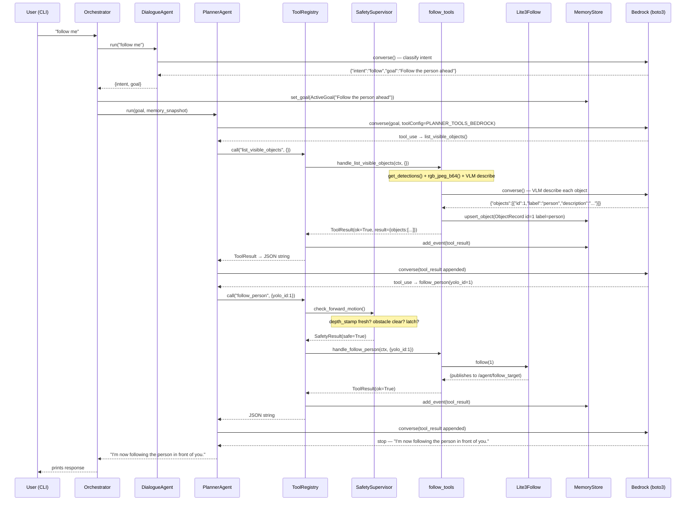

# Agent Architecture

## Overview

The pipeline adds a layered architecture on top of the existing robot adapters. All LLM calls go through AWS Bedrock (boto3 native Converse API). The legacy single-loop mode is preserved behind `LEGACY_LOOP=1`.

---

## Layer diagram

```
┌─────────────────────────────────────────────────────────┐
│  CLI  (cli.py)                                          │
│  User types a message → answer printed                  │
└───────────────────────┬─────────────────────────────────┘
                        │ user_text
                        ▼
┌─────────────────────────────────────────────────────────┐
│  Orchestrator  (agents_app/orchestrator.py)             │
│  Sequences: dialogue → goal → planner → response        │
└──────────┬────────────────────────────┬─────────────────┘
           │                            │
           ▼                            ▼
┌──────────────────┐        ┌───────────────────────────┐
│  DialogueAgent   │        │  PlannerAgent             │
│  (single LLM     │  goal  │  (multi-turn tool loop,   │
│   call, no tools)│──────▶ │   up to 8 steps)          │
│                  │        │                           │
│  Bedrock Converse│        │  Bedrock Converse         │
│  → JSON intent   │        │  + toolConfig             │
└──────────────────┘        └─────────────┬─────────────┘
                                          │ tool calls
                                          ▼
┌─────────────────────────────────────────────────────────┐
│  ToolRegistry  (tools/registry.py)                      │
│  • Caller permission check (planner / operator)         │
│  • Safety gate (forward / any-motion check)             │
│  • Event logging to MemoryStore                         │
└───┬───────────┬────────────┬───────────┬───────────────┘
    │           │            │           │
    ▼           ▼            ▼           ▼
┌───────┐ ┌────────┐ ┌───────────┐ ┌──────────┐
│Safety │ │Percep- │ │  Motion   │ │  Follow  │
│tools  │ │tion    │ │  tools    │ │  tools   │
│       │ │tools   │ │           │ │          │
│stop   │ │describe│ │walk fwd/  │ │follow_   │
│emerg- │ │_scene  │ │bwd        │ │person    │
│ency   │ │read_   │ │turn l/r   │ │go_to_    │
│check_ │ │label   │ │stop_      │ │object    │
│safety │ │get_    │ │motion     │ │stop_     │
│get_   │ │rgbd    │ │           │ │tracking  │
│status │ │list_   │ │           │ │          │
│       │ │objects │ │           │ │          │
└───┬───┘ └───┬────┘ └─────┬─────┘ └────┬─────┘
    │         │            │            │
    │         ▼            ▼            ▼
    │   ┌───────────┐ ┌──────────┐ ┌──────────┐
    │   │VLMClient  │ │Lite3     │ │Lite3     │
    │   │(vlm_      │ │Motion    │ │Follow    │
    │   │client.py) │ │(robot/   │ │(robot/   │
    │   │           │ │motion.py)│ │follow.py)│
    │   │boto3      │ │          │ │          │
    │   │Bedrock    │ │/cmd_vel  │ │/agent/   │
    │   │Converse   │ │ROS2 9091 │ │yolo_det* │
    │   └───────────┘ └──────────┘ │ROS2 9091 │
    │                              └──────────┘
    │
    ▼
┌─────────────────────────────────────────────────────────┐
│  SafetySupervisor  (safety/supervisor.py)               │
│  Deterministic — no LLM involved                        │
│  Reads MemoryStore.robot.depth_stamp +                  │
│  nearest_obstacle_mm                                     │
│                                                         │
│  check_forward_motion():                                │
│    1. emergency latch? → BLOCK                          │
│    2. depth_stamp > 5 s old? → BLOCK                   │
│    3. nearest_obstacle_mm < 400? → BLOCK               │
│    else → OK                                            │
│                                                         │
│  check_any_motion():                                    │
│    1. emergency latch? → BLOCK                          │
│    else → OK                                            │
└─────────────────────────────────────────────────────────┘

┌─────────────────────────────────────────────────────────┐
│  MemoryStore  (memory/store.py)  — shared state         │
│  Thread-safe in-memory blackboard                       │
│                                                         │
│  robot: RobotStateSnapshot                              │
│    depth_stamp, nearest_obstacle_mm,                    │
│    rosbridge_connected, …                               │
│                                                         │
│  objects: dict[yolo_id → ObjectRecord]                  │
│    label, description, bbox, position_text, depth_m,   │
│    seen_count, last_seen_ts                             │
│                                                         │
│  goal: ActiveGoal                                       │
│    description, status, selected_object_id              │
│                                                         │
│  events: list[Event]  (capped at 200)                   │
│    every tool_call / tool_result / safety_block         │
└─────────────────────────────────────────────────────────┘
```

---

## ROS bridge topology

```
Laptop                          Robot (192.168.1.103)
──────────────────────────────────────────────────────
Lite3Robot ────── ws:9090 ──── rosbridge (ROS 1 noetic)
                                  /camera/color/image_raw
                                  /camera/depth/image_rect_raw
                                  /leg_odom

Lite3Motion ─┐
             ├── ws:9091 ──── rosbridge (ROS 2 foxy)
Lite3Follow ─┘                  /cmd_vel
                                  /agent/follow_target
                                  /agent/yolo_detections
```

---

## Control flow: user says "follow me"



---

## Safety gates by tool

| Tool | Safety check | Blocks when |
|---|---|---|
| `walk_forward` | `check_forward_motion()` | depth stale, obstacle < 400 mm, or emergency latched |
| `follow_person` | `check_forward_motion()` | same as above |
| `go_to_object` | `check_forward_motion()` | same as above |
| `walk_backward` | `check_any_motion()` | emergency latched only |
| `turn_left` | `check_any_motion()` | emergency latched only |
| `turn_right` | `check_any_motion()` | emergency latched only |
| `stop`, `stop_motion`, `stop_tracking` | none | always allowed |
| `emergency_stop` | none | always allowed |
| `reset_emergency_stop` | none | operator caller only |
| all perception / memory tools | none | always allowed |

Depth data is refreshed by `get_rgbd_summary` and `get_robot_status`. The planner's system prompt enforces calling one of these before any forward motion.

---

## File map

```
agent/
├── cli.py                      entry point — REPL loop
│
├── agents_app/
│   ├── orchestrator.py         sequences dialogue → planner
│   ├── sdk_agents.py           DialogueAgent + PlannerAgent (boto3 Converse)
│   └── sdk_tools.py            tool schemas (Bedrock + OpenAI formats) + dispatch
│
├── memory/
│   ├── schemas.py              RobotStateSnapshot, ObjectRecord, ActiveGoal, Event
│   └── store.py                MemoryStore (thread-safe blackboard)
│
├── safety/
│   └── supervisor.py           SafetySupervisor (deterministic, no LLM)
│
├── tools/
│   ├── base.py                 ToolResult, ToolContext
│   ├── registry.py             ToolRegistry (permissions + safety gate + logging)
│   ├── setup.py                build_registry() — wires all handlers
│   ├── safety_tools.py
│   ├── perception_tools.py
│   ├── motion_tools.py
│   ├── follow_tools.py
│   └── memory_tools.py
│
├── vlm_client.py               VLM abstraction (boto3 Bedrock or OpenAI-compat)
│
├── robot/                      unchanged — hardware adapters
│   ├── lite3.py                Lite3Robot (camera, depth, pose — ROS 1 ws:9090)
│   ├── motion.py               Lite3Motion (/cmd_vel — ROS 2 ws:9091)
│   ├── follow.py               Lite3Follow (YOLO tracker — ROS 2 ws:9091)
│   └── ros_client.py           shared ROS 2 websocket
│
├── tests/
│   ├── test_memory.py          13 tests
│   ├── test_safety_supervisor.py  12 tests
│   └── test_tool_registry.py   11 tests
│
└── scripts/
    ├── smoke_test_pipeline.py  3-interaction end-to-end test
    └── test_isolation.py       (existing) subsystem diagnostics
```

---

## Legacy vs new pipeline

```
LEGACY_LOOP=1              LEGACY_LOOP=0 (default)
──────────────────         ──────────────────────────────────────
cli.py                     cli.py
  └─ run_once()              └─ Orchestrator.run()
       │                           ├─ DialogueAgent   (Bedrock)
       │ Bedrock Converse          └─ PlannerAgent    (Bedrock + tools)
       │ toolConfig=                      │ ToolRegistry
       │   TOOL_SCHEMAS                   │   SafetySupervisor
       │ dispatch()                       │   handler(ctx, args)
       └─ robot adapters           └─ robot adapters
                                   └─ MemoryStore updated per call
```
