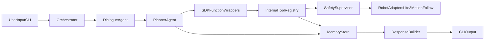

# Simplified Agent Pipeline Plan (OpenAI SDK)

## Target outcome
Deliver a lean, demo-ready pipeline matching the architecture document's minimal flow:

`User message -> Orchestrator -> Planner/Perception tools -> Memory update -> final response`

and supporting `follow_person` / `go_to_object` with deterministic safety validation.

## Baseline and reuse strategy
- Reuse robot connectivity and adapters from [C:/Users/pamar/Desktop/robohack-2026/agent/robot/lite3.py](C:/Users/pamar/Desktop/robohack-2026/agent/robot/lite3.py), [C:/Users/pamar/Desktop/robohack-2026/agent/robot/motion.py](C:/Users/pamar/Desktop/robohack-2026/agent/robot/motion.py), [C:/Users/pamar/Desktop/robohack-2026/agent/robot/follow.py](C:/Users/pamar/Desktop/robohack-2026/agent/robot/follow.py), and [C:/Users/pamar/Desktop/robohack-2026/agent/robot/ros_client.py](C:/Users/pamar/Desktop/robohack-2026/agent/robot/ros_client.py).
- Split current monolithic tools in [C:/Users/pamar/Desktop/robohack-2026/agent/tools/perception.py](C:/Users/pamar/Desktop/robohack-2026/agent/tools/perception.py) into internal tool modules plus thin SDK wrappers.
- Preserve successful bringup and runtime assumptions from [C:/Users/pamar/Desktop/robohack-2026/agent/RUNBOOK.md](C:/Users/pamar/Desktop/robohack-2026/agent/RUNBOOK.md) and env conventions in [C:/Users/pamar/Desktop/robohack-2026/agent/.env.example](C:/Users/pamar/Desktop/robohack-2026/agent/.env.example).
- Align with sections "Core tool subset", "Recommended first milestone", and "Minimal viable architecture" in [C:/Users/pamar/Desktop/robohack-2026/software_architecture_agents_rosbridge.md](C:/Users/pamar/Desktop/robohack-2026/software_architecture_agents_rosbridge.md).

## Proposed simplified architecture (in-repo)
- Add minimal packages under `agent/`:
  - `agents_app/`: SDK agents + orchestrator
  - `memory/`: in-memory blackboard (robot state, objects, goal, recent events)
  - `tools/`: internal registry + grouped tools + SDK wrappers
  - `safety/`: deterministic movement checks
- Keep existing `robot/` code as Layer 1 implementation.
- Keep current CLI entrypoint but route request handling through orchestrator.

## Minimal tool surface for this phase
- **Safety/status**: `stop`, `emergency_stop`, `check_safety`, `get_robot_status`
- **Perception**: `describe_scene`, `read_label`, `get_rgbd_summary`, `get_depth_at_pixel`, `list_visible_objects`
- **Memory/reasoning**: `get_visible_objects`, `find_object`, `resolve_reference`, `find_objects_matching_constraints`
- **Motion/follow**: `walk_forward`, `walk_backward`, `turn_left`, `turn_right`, `stop_motion`, `follow_person`, `go_to_object`, `stop_tracking`

## Implementation phases

### Phase 1: Core scaffolding and context
- Create `memory/schemas.py` and `memory/store.py` with only required fields for this demo: robot status snapshot, object records, active goal, recent events, current plan.
- Create `tools/base.py` (`ToolResult`, tool protocol) and `tools/registry.py` (caller permissions + safety hook + event logging).
- Create `tools/context.py` to pass `memory`, `robot`, `motion`, `follow`, `vlm`, and `safety` without exposing raw rosbridge to agents.

### Phase 2: Internal tools extraction
- Refactor current handlers in [C:/Users/pamar/Desktop/robohack-2026/agent/tools/perception.py](C:/Users/pamar/Desktop/robohack-2026/agent/tools/perception.py) into grouped modules:
  - `tools/perception_tools.py`
  - `tools/motion_tools.py`
  - `tools/follow_tools.py`
  - `tools/memory_tools.py`
  - `tools/safety_tools.py`
- Keep behavior identical initially; focus on moving code behind registry calls and returning structured `ToolResult`.

### Phase 3: Safety supervisor (deterministic)
- Add `safety/supervisor.py` with checks before movement/follow:
  - stale/no depth -> block forward motion
  - obstacle too close (`depth_summary.min_mm`) -> block forward commands
  - emergency latch blocks all movement until operator reset command
- Make movement/follow tools invoke safety gate through registry, never directly from agent wrappers.

### Phase 4: SDK wrappers and agents
- Add `agents_app/sdk_tools.py`: thin `@function_tool` wrappers delegating to internal registry.
- Add `agents_app/sdk_agents.py`:
  - `DialogueAgent` (intent + concise user wording)
  - `PlannerAgent` (tool selection + short plan)
  - optional `PerceptionAgent` as simple handoff target for vision-heavy requests
- Add `agents_app/orchestrator.py` with manager-style flow (no free-form agent loops).

### Phase 5: CLI integration and migration path
- Update [C:/Users/pamar/Desktop/robohack-2026/agent/cli.py](C:/Users/pamar/Desktop/robohack-2026/agent/cli.py) to:
  - initialize `MemoryStore`, `SafetySupervisor`, `ToolRegistry`, SDK wrappers, and orchestrator
  - keep existing lock behavior and ROS bringup logic
  - route each user message through orchestrator instead of direct Bedrock tool loop
- Keep old loop behind a fallback flag (`LEGACY_LOOP=1`) for rollback during testing.

### Phase 6: Verification
- Add smoke scripts/tests:
  - `tests/test_memory.py` (object insert/update + reference resolve)
  - `tests/test_tool_registry.py` (permission + safety block)
  - `tests/test_safety_supervisor.py` (close obstacle, stale sensor, emergency latch)
  - `scripts/smoke_test_pipeline.py` (connect, run `what do you see`, `follow me`, `stop`)
- Reuse diagnostics patterns from [C:/Users/pamar/Desktop/robohack-2026/agent/scripts/test_isolation.py](C:/Users/pamar/Desktop/robohack-2026/agent/scripts/test_isolation.py).

## Acceptance criteria
- One command starts the simplified pipeline and returns grounded responses from live tools.
- Agent can:
  - describe scene,
  - identify/follow target via `list_visible_objects -> follow_person`,
  - stop immediately on command,
  - refuse unsafe movement when safety check fails.
- Memory stores at least: latest visible objects, selected target/reference, last tool events.
- Tool access and safety checks are enforced centrally in registry/safety layer.

## Risks and mitigations
- **SDK migration risk**: preserve legacy loop as feature flag fallback.
- **ROS bridge instability under burst tooling**: keep `RGB_MAX_HZ` / `DEPTH_MAX_HZ` caps and avoid duplicate subscriptions.
- **Tracker intermittence**: keep `follow` tools non-fatal; return structured empty/timeout results and continue dialogue.
